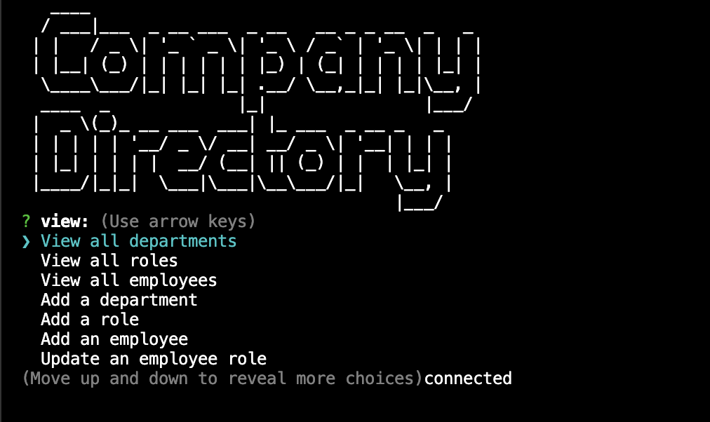

# Employee Directory  

  - [Description](#description)
  - [Installation](#installation)
  - [Usage](#usage)
  - [Contributions](#contributions)
  - [Tests](#tests)
  - [Questions](#questions)
  - [License?](#license)

  ## Description
 
  A CLI tool for administrators to organize their company departments, roles, and employeesuseing a mysql database.

  ## Installation

  Clone the project and run with `node index.js`

  ## Usage

  > Any organization that requires as a hierarchacal structure for their mysql database.

  ## Contributions
  
  I am the sole author of this project. Please email me with any questions.

  ## Tests

  no tests

  ## Questions

  [My Github profile](https://github.com/guitarkeegan)

  Send me and email [here](mailto:keegananglim@gmail.com) to contact me directly.

  ## License
  This project is licensed under the [MIT License](https://choosealicense.com/licenses/mit/) - click the link to read the license.
  
 ## Demo

 [Video Demo](https://www.loom.com/share/cec2ffe30c7f49819a624d53e9034808)

 